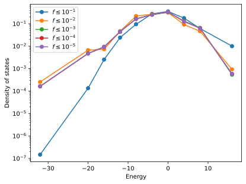
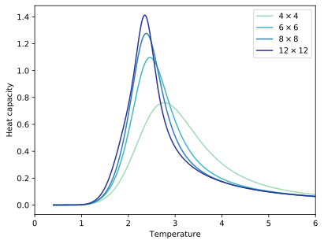

.. _example_wang_landau_simulations:
.. highlight:: python
.. index::
   single: Examples; Wang-Landau simulations

Wang-Landau simulations
=======================

This example illustrates how to carry out `Wang-Landau (WL)
<https://en.wikipedia.org/wiki/Wang_and_Landau_algorithm>`_ simulations with
:program:`icet`. Compared to :term:`Monte-Carlo (MC) <MC>` simulations in conventional
thermodynamic ensembles there are a view differences to be aware of. It is
therefore strongly recommended to work through this *entire* example before
running your own WL simulations.

Background
----------

When sampling a thermodynamic ensemble, say the canonical or semi-grand
canonical ones, one conducts :term:`MC` simulations at a given
temperature, commonly in order to gather thermodynamic averages of some
observables. In order to obtain the temperature dependence of these quantities
one has to conduct a series of simulations at different temperatures. In
particular, in the vicinity of  phase transitions these simulations can become
tedious or close to impossible to converge.

Here, the WL algorithm provides an alternative approach. It allows one to
extract the microcanonical density of states, from which many other
thermodynamic quantities can be calculated [WanLan01a]_ [LanTsaExl04]_.
Usually the DOS is acquired as a function of the energy. To this end, the WL
algorithm accumulates both the microcanonical entropy :math:`S(E)` and a
histogram :math:`H(E)` on an energy grid with a predefined spacing (see
argument ``energy_spacing`` of :class:`WangLandauEnsemble
<mchammer.ensembles.WangLandauEnsemble>`).

The algorithm is initialized as follows.

#. Generate an initial configuration.
#. Initialize counters for the microcanonical entropy
   :math:`S(E)` and the histogram :math:`H(E)` to zero.
#. Set the fill factor :math:`f=1`.

It then proceeds as follows.

#. Propose a new configuration (see argument ``trial_move`` of
   :class:`WangLandauEnsemble <mchammer.ensembles.WangLandauEnsemble>`).

#. Accept or reject the new configuration with probability

   .. math::

      P = \min \{ 1, \, \exp [ S(E_\mathrm{new}) - S(E_\mathrm{cur}) ] \},

   where :math:`E_\mathrm{cur}` and :math:`E_\mathrm{new}` are the
   energies of the current and new configurations, respectively.

#. Update the microcanonical entropy :math:`S(E)\leftarrow S(E) + f`
   and histogram :math:`H(E) \leftarrow H(E) + 1` where
   :math:`E` is the energy of the system at the end of the move.

#. Check the flatness of the histogram :math:`H(E)`. If
   :math:`H(E) > \chi \langle H(E)\rangle\,\forall E` reset the histogram
   :math:`H(E) = 0` and reduce the fill factor :math:`f \leftarrow f / 2`.
   The parameter :math:`\chi` is set via the argument ``flatness_limit`` of
   :class:`WangLandauEnsemble <mchammer.ensembles.WangLandauEnsemble>`.

#. If :math:`f` is smaller than a certain threshold (commonly between
   :math:`10^{-8}` and :math:`10^{-6}`, see argument ``fill_factor_limit``
   of :class:`WangLandauEnsemble <mchammer.ensembles.WangLandauEnsemble>`),
   terminate the loop, otherwise return to 1.

The microcanonical entropy :math:`S(E)` and the histogram along
with related information are written to the data container every
time :math:`f` is updated. Using the density :math:`\rho(E) = \exp S(E)`
one can then readily compute various thermodynamic quantities,
including, e.g., the average energy:

.. math::

   \left<E\right>(T) = \frac{\sum_E E \rho(E) \exp(-E / k_B T)}{
   \sum_E \rho(E) \exp(-E / k_B T)}

Similarly, it is also possible to compute averages and standard deviations of
any other observable in the data container.

2D Ising model
--------------

The `two-dimensional Ising model
<https://en.wikipedia.org/wiki/Ising_model#Two_dimensions>`_ is well suited
for demonstrating the utility of the WL algorithm and has been extensively
studied in the literature [WanLan01a]_ [WanLan01b]_ [LanTsaExl04]_. The model
exhibits a continuous phase transition, which occurs at :math:`T_c = 2 J / k_B
\ln (1 + \sqrt{2}) \approx 2.26919 J / k_B` in the infinite system-size limit.
In this example, we use the 2D Ising model as a computationally inexpensive
toy model.

The following code generates a cluster expansion that represents the 2D Ising
model. Here, Au and Ag are used as dummy species. Internally they are
represented by :math:`0` and :math:`1`, while in the Ising model the species
are represented by spins of :math:`+1` and :math:`-1`. The effective cluster
interaction for the first-nearest neighbor pair is therefore set to
:math:`J=2` (as opposed to :math:`J=1`). By means of this transformation the
energy/temperature scales remains invariant.

.. literalinclude:: ../../../../examples/advanced_topics/wang_landau/1_run_single_wang_landau_simulation.py
   :start-after: # Prepare cluster expansion
   :end-before: # Prepare initial configuration

Running a WL simulation
-----------------------

For computational convenience, here, we consider a very small system of only
:math:`4\times4 = 16` sites.

.. literalinclude:: ../../../../examples/advanced_topics/wang_landau/1_run_single_wang_landau_simulation.py
   :start-after: # Prepare initial configuration
   :end-before: # Set up and run MC simulation

A WL simulation is set up and run similar to a thermodynamic ensemble.

.. literalinclude:: ../../../../examples/advanced_topics/wang_landau/1_run_single_wang_landau_simulation.py
   :start-after: # Set up and run MC simulation

In this simple example, we only need to set the energy spacing
(``energy_spacing=1``). In the case of this very simple model, the energy
spectrum is discrete and the choice of the energy spacing is straightforward.
While for arbitrary CEs the energy spectrum is technically discrete it is
practically continuous and the choice of the energy sapcing requires more care
as illustrated below.

Analyzing a WL simulation
-------------------------

The data container file contains all the information that is needed for
extracting thermodynamic data from a WL simulation. In addition to the regular
fields found in most data containers such as ``mctrial``, ``potential``, or
``acceptance_ratio``, a WL data container contains the fields ``fill_factor``,
which is the current value of :math:`f`, ``histogram``, and ``entropy``.

.. literalinclude:: ../../../../examples/advanced_topics/wang_landau/2_analyze_single_wang_landau_simulation.py
   :start-after: # Read data container
   :end-before: # Plot density

These data are not written at every step as they consume quite a lot of space.
Rather they are only added to the data container when the fill factor
:math:`f` is updated or the maximum number of MC trial steps has been reached.

:program:`icet` provides support functions to make the analysis of these data
particularly simple. One can for example extract the (relative) entropy as
well as the DOS.

.. literalinclude:: ../../../../examples/advanced_topics/wang_landau/2_analyze_single_wang_landau_simulation.py
   :start-after: # Plot density
   :end-before: # Compute thermodynamic

For the present, very small system, the number of energy bins is small and the
DOS is not very smooth.

  Density of states from Wang-Landau simulation of :math:`4\times4`
  two-dimensional Ising model.

The thermodynamic averages of observables can be extracted using
:func:`get_averages_wang_landau
<mchammer.ensembles.get_averages_wang_landau>`, which enables one for example
to compute the heat capacity as a function of temperature.

.. literalinclude:: ../../../../examples/advanced_topics/wang_landau/2_analyze_single_wang_landau_simulation.py
   :start-after: # Compute thermodynamic

The heat capacity obtained using the WL approach matches those from a series
of MC simulations in the canonical ensemble (not described here). The
availability of the full DOS enables one, however, to extract the heat
capacity as a practically continuous function of temperature.

  Heat capacity from Wang-Landau simulation of a :math:`4\times4`
  two-dimensional Ising model in comparison with a series of simulations in
  the canonical ensemble.

Size-dependence of transition temperature
-----------------------------------------

For the system size considered here one obtains a critical temperature of
:math:`T_c(N=16) = 2.742 J / k_B`. This is still quite far off from the value
of :math:`T_c(N\rightarrow\infty) = 2.26919 J / k_B` that one obtains
analytically for the infinite-size limit. Using the WL algorithm this system
size dependence can be explored rather efficiently.

  Heat capacity from Wang-Landau simulations of the two-dimensional Ising model for different system sizes.

With increasing system size the peak in the heat capacity both sharpens and
shifts to the left, approaching the infinite-size limit in the expected
fashion.

Binned Wang-Landau simulations
------------------------------

* describe problem and solution
* describe advantages of binned approach
* show results from constant bin width using simulation results
* show improvements (?) of variable bin widths using previous simulation results
* describe function and script based on it

Tips
----
* set write_periods to a finite value
* restarts
* start from low/high-energy configurations
* pre-seed entropy

Source code
-----------

.. container:: toggle

    .. container:: header

       The complete source code is available in
       ``examples/1_run_single_wang_landau_simulation.py``

    .. literalinclude:: ../../../../examples/advanced_topics/wang_landau/1_run_single_wang_landau_simulation.py

.. container:: toggle

    .. container:: header

       The complete source code is available in
       ``examples/2_analyze_single_wang_landau_simulation.py``

    .. literalinclude:: ../../../../examples/advanced_topics/wang_landau/2_analyze_single_wang_landau_simulation.py
