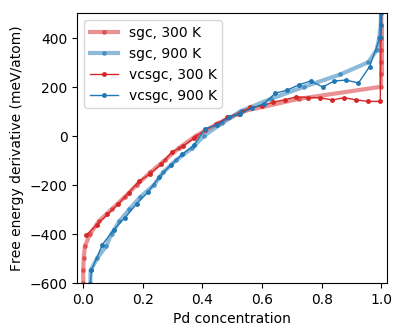
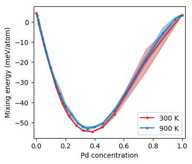
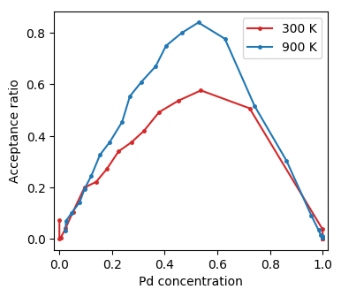

.. _tutorial_monte_carlo_analysis:
.. highlight:: python
.. index::
   single: Tutorial; Analyze Monte Carlo simulations

Analyze Monte Carlo simulations
===============================

After the :ref:`Monte Carlo simulations <tutorial_monte_carlo_simulations>`
have finished, they can be analyzed in various ways. With dense sampling, it
may take several minutes to load the data. It is therefore recommended to
first collect all data in an averaged form. Here, we read all data containers
and take averages but discard data collected during the first five MC cycles
to allow for equilibration (please be aware that five MC cycles may be
insufficient).

.. literalinclude:: ../../../../tutorial/basic/6_collect_monte_carlo_data.py
   :start-after: # step 1
   :end-before: # step 2

Finally, we create a `pandas DataFrame object <https://pandas.pydata.org
/pandas-docs/stable/generated/pandas.DataFrame.html>`_ which we save to a csv
file for future access.

.. literalinclude:: ../../../../tutorial/basic/6_collect_monte_carlo_data.py
   :start-after: # step 2

Now we can easily and quickly load the aggregated data and plot properties of
interest, such as the free energy derivative as a function of
composition.

.. literalinclude:: ../../../../tutorial/basic/7_plot_monte_carlo_data.py
   :start-after: # step 1
   :end-before: # step 2

  Free energy derivative as a function of concentration from Monte Carlo
  simulations in the semi-grand canonical and variance-constrained semi-grand
  canonical ensemble (the curves are noisy due to insufficient sampling).

A gap in the SGC data around 85% Pd indicates a very assymmetric miscibility
gap and is in qualitative agreement with `experimental assessments of the
phase diagram <http://resource.npl.co.uk/mtdata/phdiagrams/agpd.htm>`_. The
VCSGC simulation succeeds to sample also inside the miscibility gap, but a
longer simulation is required to suppress noise.

It can also be instructive to plot the mixing energy.

.. literalinclude:: ../../../../tutorial/basic/7_plot_monte_carlo_data.py
   :start-after: # step 2
   :end-before: # step 3

  Mixing energy as a function of concentration from Monte Carlo simulations in
  the semi-grandcanonical ensemble.

Furthermore one might want to consider for example the acceptance rates.

.. literalinclude:: ../../../../tutorial/basic/7_plot_monte_carlo_data.py
   :start-after: # step 3

  Acceptance ratio as a function of concentration from Monte Carlo simulations
  in the semi-grandcanonical ensemble.

As expected the acceptance rate increases with temperature and is maximal for
intermediate concentrations.

Source code
-----------

.. container:: toggle

    .. container:: header

       The complete source code is available in
       ``tutorial/basic/6_analyze_monte_carlo.py``
       and
       ``tutorial/basic/7_plot_monte_carlo_data.py``

    .. literalinclude:: ../../../../tutorial/basic/6_collect_monte_carlo_data.py
    .. literalinclude:: ../../../../tutorial/basic/7_plot_monte_carlo_data.py
